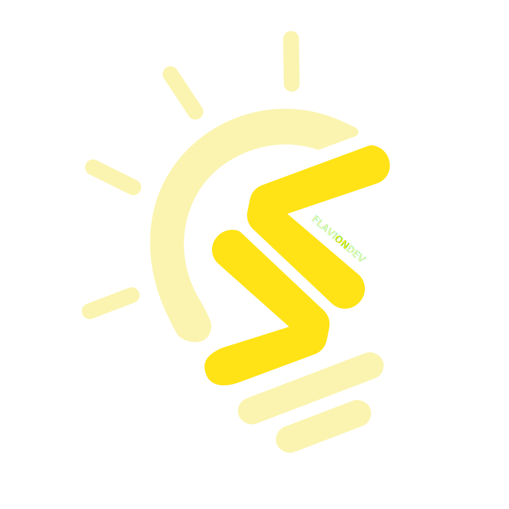

## Hi guys 👋

Me chamo Flávio, desenvolvedor desde 2020 e profundamente apaixonado por tecnologias web e sistemas escaláveis. Atualmente trabalho na Tallos como dev fullstack. Além disso, produzo contéudos bastante interessantes para ajudar a comunidade dev!

 

[![instagram flaviondev][insta-badge]][insta-flaviondev]
[![linkeding flavio nobre][linkedin-badge]][linkedin-flavio]
[![linkeding flavio nobre][medium-badge]][medium-flavio]

  
  

## Stack

![JavaScript][JavaScript]
![TypeScript][TypeScript]
![Node.Js][Node.Js]
![Nest.Js][Nest.Js]
![Express][Express]
![Docker][Docker]
![Kafka][Kafka]
![Kong][Kong]
![Nginx][Nginx]
![Shell][Shell] 
![MongoDB][MongoDB]
![Redis][Redis]
![Grafana][Grafana]
![Prometheus][Prometheus]
![HTML][HTML]
![CSS][CSS]
![Vue][Vue]
![Nuxt][Nuxt]
![Figma][Figma]
![Git][Git]
![GitHub][GitHub]
![GitLab][GitLab]
![Markdown][Markdown]
![Visual Studio Code][vscode]

  

<!-- TODO: ocultando posts recentes por enquanto -->
<!-- ## Posts Recentes no Medium

<a target="_blank" href="https://github-readme-medium-recent-article.vercel.app/medium/@flavionobre11/0"> 
 
<a target="_blank" href="https://github-readme-medium-recent-article.vercel.app/medium/@flavionobre11/1"> -->

<!-- ========== variables ========== -->

<!-- social network -->
[insta-flaviondev]: https://www.instagram.com/flaviondev
[insta-badge]: https://img.shields.io/badge/-@flaviondev-FFE316?style=for-the-badge&logo=Instagram&logoColor=383332
[linkedin-flavio]: https://www.linkedin.com/in/flavionobree
[linkedin-badge]: https://img.shields.io/badge/-Linkedin-FFE316?style=for-the-badge&logo=Linkedin&logoColor=383332
[medium-flavio]: https://medium.com/@flavionobre11
[medium-badge]: https://img.shields.io/badge/-Medium-FFE316?style=for-the-badge&logo=Medium&logoColor=383332

<!-- stack -->
[JavaScript]: https://img.shields.io/badge/-JavaScript-383332?style=flat-square&logo=javascript&logoColor=FFE316
[TypeScript]: https://img.shields.io/badge/-TypeScript-383332?style=flat-square&logo=typescript&logoColor=FFE316
[Node.js]: https://img.shields.io/badge/-Node.js-383332?style=flat-square&logo=node.js&logoColor=FFE316
[Nest.js]: https://img.shields.io/badge/-Nest.js-383332?style=flat-square&logo=NestJs&logoColor=FFE316
[Express]: https://img.shields.io/badge/-Express-383332?style=flat-square&logo=express&logoColor=FFE316
[Docker]: https://img.shields.io/badge/-Docker-383332?style=flat-square&logo=Docker&logoColor=FFE316
[Kafka]: https://img.shields.io/badge/-Kafka-383332?style=flat-square&logo=apachekafka&logoColor=FFE316
[Kong]: https://img.shields.io/badge/-Kong-383332?style=flat-square&logo=kong&logoColor=FFE316
[Nginx]: https://img.shields.io/badge/-Nginx-383332?style=flat-square&logo=nginx&logoColor=FFE316
[Shell]: https://img.shields.io/badge/-Shell-383332?style=flat-square&logo=gnu-bash&logoColor=FFE316
[MongoDB]: https://img.shields.io/badge/-MongoDB-383332?style=flat-square&logo=MongoDB&logoColor=FFE316
[Redis]: https://img.shields.io/badge/-Redis-383332?style=flat-square&logo=redis&logoColor=FFE316
[Grafana]: https://img.shields.io/badge/-Grafana-383332?style=flat-square&logo=grafana&logoColor=FFE316
[Prometheus]: https://img.shields.io/badge/-Prometheus-383332?style=flat-square&logo=prometheus&logoColor=FFE316
[HTML]: https://img.shields.io/badge/-HTML-383332?style=flat-square&logo=HTML5&logoColor=FFE316
[CSS]: https://img.shields.io/badge/-CSS-383332?style=flat-square&logo=CSS3&logoColor=FFE316
[Vue]: https://img.shields.io/badge/-Vue.js-383332?style=flat-square&logo=Vue.js&logoColor=FFE316
[Nuxt]: https://img.shields.io/badge/-Nuxt.js-383332?style=flat-square&logo=Nuxt.js&logoColor=FFE316
[Figma]: https://img.shields.io/badge/-Figma-383332?style=flat-square&logo=figma&logoColor=FFE316
[Git]: https://img.shields.io/badge/-Git-383332?style=flat-square&logo=git&logoColor=FFE316
[GitHub]: https://img.shields.io/badge/-GitHub-383332?style=flat-square&logo=github&logoColor=FFE316
[GitLab]: https://img.shields.io/badge/-GitLab-383332?style=flat-square&logo=GitLab&logoColor=FFE316
[Markdown]: https://img.shields.io/badge/-Markdown-383332?style=flat-square&logo=markdown&logoColor=FFE316
[vscode]: https://img.shields.io/badge/-Visual%20Studio%20Code-383332?style=flat-square&logo=visual-studio-code&logoColor=FFE316